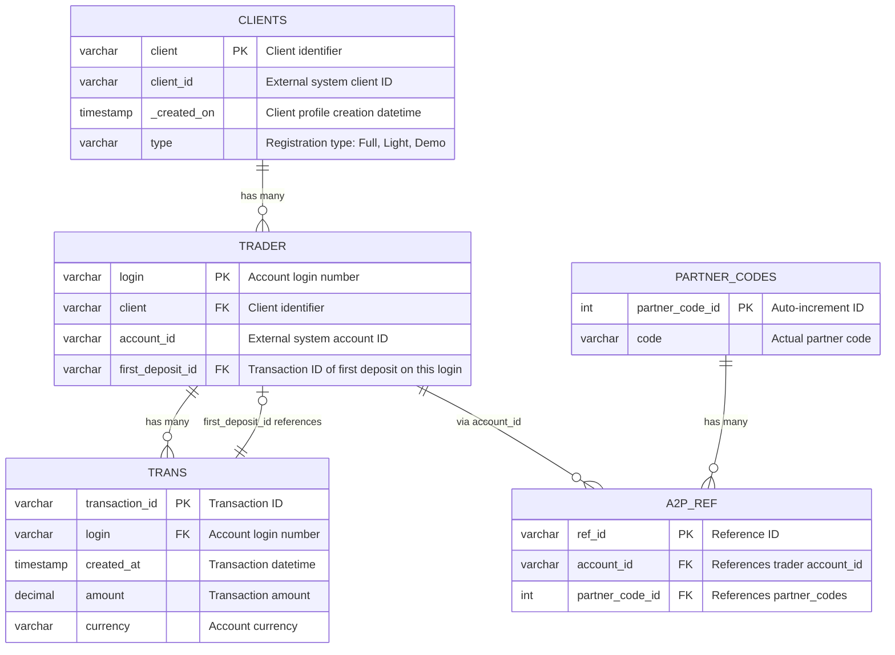

# FTDs-over-time-case-study
The goal of this study is to provide information about first time deposits (FTD) over time on client level. FTD is  calculated as the first deposit the client made across all of their loggins.

# Data Structure

## trans.csv
File **trans** contains data about all deposits that happened during the given period with the following columns:
 - **login** – account login number
 - **created_at** – datetime of the transaction. Timezone can be ignored for the purposes of this case study.
 - **transaction_id** – ID of the transaction
 - **amount** – amount of the transaction in account currency
 - **currency** – account currency

 ## trader.csv
 File **trader** contains data about individual trading accounts with the following columns:
 - **login** – account login number where the relationship between **login** and **transaction_id** is 1:N
 - **client** – client identifier
 - **account_id** – another ID describing the account from an external system
 - **first_deposit_id** – transaction_id of the first deposit on that specific login

 ## clients.csv
 File **clients** contains data about clients with the following columns:
 - **client** – client identifier where the relationship between **client** and **login** is 1:N
 - **client_id** – another ID describing the client from an external system
 - **_created_on** – datetime of when the client profile was created
 - **type** – registration type. “Full” and “Light” are live registrations, “Demo” is demo

 ## partner_codes.csv
 File **partner_codes** contains a list of partner codes along with a unique **partner_code_id** assigned to them which 
is just an auto-increment value. The actual partner code is in the column **code**.

## a2p_ref.csv
File **a2p_ref** is a reference table between accounts and partner codes.
 - **account_id** is ID from **trader**
 - **ref_id** is just the reference ID
 - **partner_code_id** is reference from **partner codes**

# Database Schema - Mermaid ER Diagram

## Entity Relationship Diagram

## Relationship Summary

| From Table | Relationship | To Table | Description |
|------------|--------------|----------|-------------|
| CLIENTS | 1:N | TRADER | One client has multiple trading accounts |
| TRADER | 1:N | TRANS | One login has multiple transactions |
| TRANS | N:1 | TRADER | First deposit references back to transaction |
| TRADER | 1:N | A2P_REF | Accounts linked to partner codes |
| PARTNER_CODES | 1:N | A2P_REF | Partner codes linked to accounts |

## Notes

- **FTD (First Time Deposit)**: Calculated as the first deposit across ALL logins for a client
- **Registration Types**: "Full" and "Light" are live registrations, "Demo" is demo account
- **Timezone**: Can be ignored for transaction timestamps in this case study
