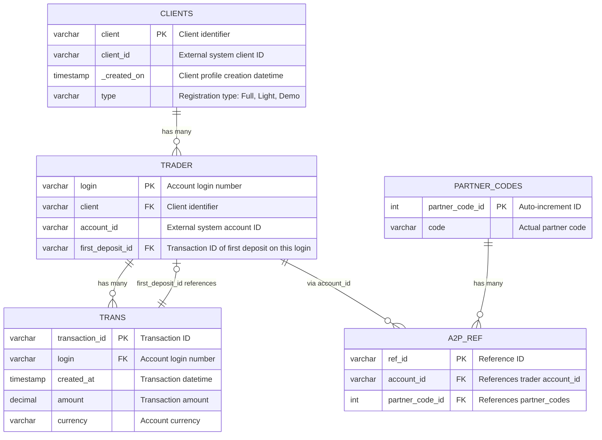

# FTDs-over-time-case-study

The goal of this study is to provide information about first time deposits (FTD) over time on client level. FTD is  calculated as the first deposit the client made across all of their loggins.

# Quick Start

```bash
conda env create -f environment.yml
conda activate ftd-analysis
```

# Data Structure

## trans.csv
File **trans** contains data about all deposits that happened during the given period with the following columns:
 - **login** – account login number
 - **created_at** – datetime of the transaction. Timezone can be ignored for the purposes of this case study.
 - **transaction_id** – ID of the transaction
 - **amount** – amount of the transaction in account currency
 - **currency** – account currency

 ## trader.csv
 File **trader** contains data about individual trading accounts with the following columns:
 - **login** – account login number where the relationship between **login** and **transaction_id** is 1:N
 - **client** – client identifier
 - **account_id** – another ID describing the account from an external system
 - **first_deposit_id** – transaction_id of the first deposit on that specific login

 ## clients.csv
 File **clients** contains data about clients with the following columns:
 - **client** – client identifier where the relationship between **client** and **login** is 1:N
 - **client_id** – another ID describing the client from an external system
 - **_created_on** – datetime of when the client profile was created
 - **type** – registration type. “Full” and “Light” are live registrations, “Demo” is demo

 ## partner_codes.csv
 File **partner_codes** contains a list of partner codes along with a unique **partner_code_id** assigned to them which 
is just an auto-increment value. The actual partner code is in the column **code**.

## a2p_ref.csv
File **a2p_ref** is a reference table between accounts and partner codes.
 - **account_id** is ID from **trader**
 - **ref_id** is just the reference ID
 - **partner_code_id** is reference from **partner codes**


# Database Schema - Mermaid ER Diagram

## Entity Relationship Diagram



## Relationship Summary

| From Table | Relationship | To Table | Description |
|------------|--------------|----------|-------------|
| CLIENTS | 1:N | TRADER | One client has multiple trading accounts |
| TRADER | 1:N | TRANS | One login has multiple transactions |
| TRANS | N:1 | TRADER | First deposit references back to transaction |
| TRADER | 1:N | A2P_REF | Accounts linked to partner codes |
| PARTNER_CODES | 1:N | A2P_REF | Partner codes linked to accounts |

## Notes

- **FTD (First Time Deposit)**: Calculated as the first deposit across ALL logins for a client
- **Registration Types**: "Full" and "Light" are live registrations, "Demo" is demo account
- **Timezone**: Can be ignored for transaction timestamps in this case study

# Methodology

### Validation Stage
**Objective**: Verify data integrity and identify quality issues before analysis.

**Steps performed:**
1. Schema validation: Confirmed all expected columns present in each CSV file
2. Data type verification: Validated datetime parsing and numeric fields
3. Uniqueness constraints: Checked primary keys (transaction_id, login, client, partner_code_id, ref_id) for duplicates
4. Missing value analysis: Identified null values in critical fields
5. Referential integrity checks: Verified foreign key relationships across tables:
 - trader.client → clients.client
 - trans.login → trader.login
 - trader.first_deposit_id → trans.transaction_id
 - a2p_ref.account_id → trader.account_id
 - a2p_ref.partner_code_id → partner_codes.partner_code_id
6. Logical constraints: Verified amounts > 0 and valid registration types

**Findings:**
 - Uniqueness issues: Not all code values are unique while partner_code_id is (possible repeated partner registrations)
 - Null values: Some critical foreign key fields contain null values
 - Referential integrity violations:
    - Trading accounts reference non-existent clients
    - Transactions reference non-existent traders
    - A2P references contain invalid partner code IDs
 - Data quality issues:
    - Some transaction amounts are not greater than 0
    - Invalid registration type values found
 - Data type issues: Need to convert IDs to proper types and parse dates with explicit formats

**Actions for cleaning stage:** Remove orphaned records, filter invalid amounts and registration types, convert data types, and standardize date formats.

### Cleaning Stage
**Objective**: Fix data quality issues identified during validation.

**Steps performed:**
1. Filtered transactions with invalid amounts (≤ 0)
2. Removed clients with invalid registration types
3. Removed orphaned records (traders without valid clients, transactions without valid logins)
4. Set invalid first_deposit_id references to null
5. Converted ID columns to appropriate types (Int64 for nullable integers)
6. Converted transaction amounts to USD using historical exchange rates (ECB data via `currencyconverter`)

**Result**: Clean, referentially consistent dataset ready for analysis.

### Exploration Stage
**Objective**: Understand data patterns, distributions, and relationships.

**Key findings:**
- 5,325 clients (85% Full, 8% Demo, 7% Light registrations)
- 99.4% of clients have made at least one deposit
- Average 1.47 logins per client; most clients (74%) have a single account
- Total transaction volume: $4.55M USD across 7,763 transactions
- Average transaction: $586 USD, median: $220 USD (right-skewed distribution)
- Transaction data covers 2025 only, while client registrations span multiple years

### Analysis Stage
**Objective**: Calculate client-level FTD metrics, analyze temporal patterns, and forecast future FTD activity.

**Steps performed:**
1. Joined transactions, traders, and clients into a single dataset
2. Calculated FTD per client as the earliest transaction across all logins (`groupby('client')['created_at'].idxmin()`)
3. Aggregated FTD counts and volumes by day, week, and month
4. Compared FTD characteristics across registration types (Full, Light, Demo)
5. Tested moving average models (windows 3, 5, 7, 14, 21) on an 80/20 train-test split
6. Generated a 30-day rolling MA(5) forecast for daily FTD count and volume

**Key results:**
- 5,294 FTDs totaling $3.01M USD (avg $568, median $316)
- MA(5) best-fit model (MAE = 3.25, RMSE = 3.86)
- 30-day forecast: ~76 FTDs, ~$343K volume (converges to ~2.5 FTDs/day)

# Results

Please, see the [report](05_report.html).